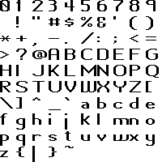
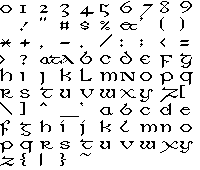
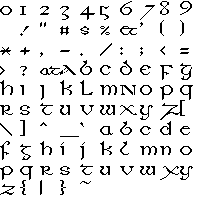
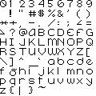
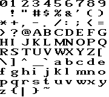
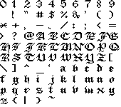
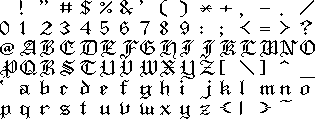

# Fonts

These fonts were covnerted from Amiga font files.

Many of them are directly from AmigaDOS or from other applications, and
also a few of them I made myself.

--

<table>
<tr> <th> AmigaDOS fonts:</th></tr>
<tr> <th> <a href="diamond_12.fnt">Diamond 12 .fnt</a></th> </tr>
<tr> <th> <a href="diamond_20.fnt">Diamond 20 .fnt</a></th> </tr>
<tr> <th> <a href="emerald_17.fnt">Emerald 17 .fnt</a></th> </tr>
<tr> <th> <a href="emerald_20.fnt">Emerald 20 .fnt</a></th> </tr>
<tr> <th> <a href="garnet_9.fnt">Garnet 9 .fnt</a></th> </tr>
<tr> <th> <a href="garnet_16.fnt">Garnet 16 .fnt</a></th> </tr>
<tr> <th> <a href="opal_9.fnt">Opal 9 .fnt</a></th> </tr>
<tr> <th> <a href="opal_12.fnt">Opal 12 .fnt</a></th> </tr>
<tr> <th> <a href="ruby_8.fnt">Ruby 8 .fnt</a></th> </tr>
<tr> <th> <a href="ruby_12.fnt">Ruby 12 .fnt</a></th> </tr>
<tr> <th> <a href="ruby_15.fnt">Ruby 15 .fnt</a></th> </tr>
<tr> <th> <a href="sapphire_14.fnt">Sapphire 14 .fnt</a></th> </tr>
<tr> <th> <a href="sapphire_19.fnt">Sapphire 19 .fnt</a></th> </tr>
<tr> <th> <a href="topaz_11.fnt">Topaz 11 .fnt</a></th> </tr>
<tr> <th> <a href="topaz_serif_8.fnt">Topaz Serif 8 .fnt</a></th> </tr>

<tr> <th> Application fonts:</th></tr>
<tr> <th> <a href="dpaint_8.fnt">Dpaint 8 .fnt</a></th> </tr>

<tr> <th> My fonts:</th></tr>
<tr> <th> <a href="ammolite_10.fnt">Ammolite 10 .fnt</a></th> </tr>
<tr> <th> <a href="onyx_9.fnt">Onyx 9 .fnt</a></th> </tr>
<tr> <th> <a href="peridot_7.fnt">Peridot_7 .fnt</a></th> </tr>
</table>

--------------------------------------------------------------------------------
The MIT License (MIT)

Copyright (c) 2022 Scott Lawrence / BleuLlama / yorgle@gmail.com

Permission is hereby granted, free of charge, to any person obtaining
a copy of this software and associated documentation files (the
"Software"), to deal in the Software without restriction, including
without limitation the rights to use, copy, modify, merge, publish,
distribute, sublicense, and/or sell copies of the Software, and to
permit persons to whom the Software is furnished to do so, subject
to the following conditions:

The above copyright notice and this permission notice shall be
included in all copies or substantial portions of the Software.

THE SOFTWARE IS PROVIDED "AS IS", WITHOUT WARRANTY OF ANY KIND,
EXPRESS OR IMPLIED, INCLUDING BUT NOT LIMITED TO THE WARRANTIES OF
MERCHANTABILITY, FITNESS FOR A PARTICULAR PURPOSE AND NONINFRINGEMENT.
IN NO EVENT SHALL THE AUTHORS OR COPYRIGHT HOLDERS BE LIABLE FOR
ANY CLAIM, DAMAGES OR OTHER LIABILITY, WHETHER IN AN ACTION OF
CONTRACT, TORT OR OTHERWISE, ARISING FROM, OUT OF OR IN CONNECTION
WITH THE SOFTWARE OR THE USE OR OTHER DEALINGS IN THE SOFTWARE.
