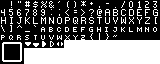
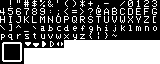
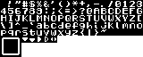
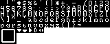
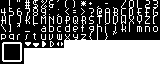
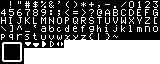
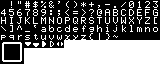
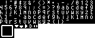

# Fonts

Most of the fonts here were created by me using Fontstruct, and 
are available as TTF (True Type Fonts) downloads there.

Some of these are just based on those fonts, but adjusted in height
and spacing to look and feel better in an 8x8 tile grid, as needed
for Pulp-based development.

If there is a -7 and a -8 version of one of these, the -8 version has
no headroom at the top of the font, so multiple lines of the text may
look jumbled.  The -7 version will have a free pixel of headroom.

Feel free to use these in any commercial or free project, just be 
sure to give me credit; link back to this repository.  They are 
provided with an MIT license, very similar to the Creative Commons
Attribution license.

--

<table>
<tr>
<th> CapsCaps 7</th>
<th> CapsCaps 8</th>
</tr><tr>
<th> Llichen 3a</th>
<th> Llichen 80</th>
</tr><tr>
<th> Onyx 7</th>
<th> Onyx 8</th>
</tr><tr>
<th> Pixel Knight Gothic 7</th>
<th> Pixel Knight Gothic 8</th>
</tr><tr>
<th> Pixician 7</th>
<th> Pixician 8</th>
</tr><tr>
<th> Gibbs</th>
<th> Ready P9</th>
<th> Courtney</th>
</tr><tr>
</tr><tr>
</tr>
</table>

--------------------------------------------------------------------------------
The MIT License (MIT)

Copyright (c) 2022 Scott Lawrence / BleuLlama / yorgle@gmail.com

Permission is hereby granted, free of charge, to any person obtaining
a copy of this software and associated documentation files (the
"Software"), to deal in the Software without restriction, including
without limitation the rights to use, copy, modify, merge, publish,
distribute, sublicense, and/or sell copies of the Software, and to
permit persons to whom the Software is furnished to do so, subject
to the following conditions:

The above copyright notice and this permission notice shall be
included in all copies or substantial portions of the Software.

THE SOFTWARE IS PROVIDED "AS IS", WITHOUT WARRANTY OF ANY KIND,
EXPRESS OR IMPLIED, INCLUDING BUT NOT LIMITED TO THE WARRANTIES OF
MERCHANTABILITY, FITNESS FOR A PARTICULAR PURPOSE AND NONINFRINGEMENT.
IN NO EVENT SHALL THE AUTHORS OR COPYRIGHT HOLDERS BE LIABLE FOR
ANY CLAIM, DAMAGES OR OTHER LIABILITY, WHETHER IN AN ACTION OF
CONTRACT, TORT OR OTHERWISE, ARISING FROM, OUT OF OR IN CONNECTION
WITH THE SOFTWARE OR THE USE OR OTHER DEALINGS IN THE SOFTWARE.
